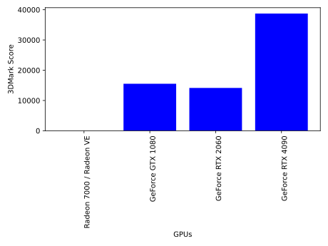

+++
title = "Is the Radeon 7000 / Radeon VE GPU good enough for Blender in 2024?"
date = "2024-04-07"
+++

If you're planning on rendering complex Blender scenes, you might be wondering if your computer is up to the task. In this post we will explore wether or not the **Radeon 7000 / Radeon VE** GPU is sufficient.

To start off, we will look at benchmark data to compare the GPU with other common GPUs. We will use [3DMark](https://benchmarks.ul.com/3dmark) benchmark results.

The **Radeon 7000 / Radeon VE** GPU received a 3DMark score of **3**. Here's how it compares to other common GPUs.

The benchmark shows a performance of 0.01% that of the GeForce RTX 4090, the currently fastest GPU on the market.

# Render time comparison

Now we will compare the time it takes to render different sample scenes by GPU. We will compare these results with our RenderFarm, in case you need your renders to finish quickly.

## Classroom scene
<video src="../classroom.mp4" width="100%" controls></video>

<table>
  <tr>
    <th>GPU</th>
    <th>Rendering Time</th>
  </tr>
  <tr>
    <td style="padding: 0 15px 0 0;">Radeon 7000 / Radeon VE</td>
    <td>4304h 46 minutes</td>
  </tr>
  <tr>
    <td style="padding: 0 15px 0 0;">GeForce GTX 1080</td>
    <td>50 minutes</td>
  </tr>
  <tr>
    <td style="padding: 0 15px 0 0;">GeForce RTX 2060</td>
    <td>55 minutes</td>
  </tr>
  <tr>
    <td style="padding: 0 15px 0 0;">GeForce RTX 4090</td>
    <td>20 minutes</td>
  </tr>
  <tr>
    <td style="padding: 0 15px 0 0;"><a href="https://renderlab.io">RenderLab.io</a></td>
    <td>4 minutes for <b>$0.00</b></td>
  </tr>
</table>
  

## Architecture scene
<video src="../architecture.mp4" width="100%" controls></video>

<table>
  <tr>
    <th>GPU</th>
    <th>Rendering Time</th>
  </tr>
  <tr>
    <td style="padding: 0 15px 0 0;">Radeon 7000 / Radeon VE</td>
    <td>3228h 35 minutes</td>
  </tr>
  <tr>
    <td style="padding: 0 15px 0 0;">GeForce GTX 1080</td>
    <td>37 minutes</td>
  </tr>
  <tr>
    <td style="padding: 0 15px 0 0;">GeForce RTX 2060</td>
    <td>41 minutes</td>
  </tr>
  <tr>
    <td style="padding: 0 15px 0 0;">GeForce RTX 4090</td>
    <td>15 minutes</td>
  </tr>
  <tr>
    <td style="padding: 0 15px 0 0;"><a href="https://renderlab.io">RenderLab.io</a></td>
    <td>3 minutes for <b>$0.00</b></td>
  </tr>
</table>
  

Are you looking to speed up your renders? [RenderLab.io](https://renderlab.io) currently offers free Cycles renders for new users. No strings attached!